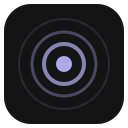

<p align="center">
  
</p>

<h1 align="center">YouTube Thumbnail Blur</h1>

A Manifest V3 Chrome/Edge extension that blurs **every** thumbnail type on
youtube.com — including thumbnails that load dynamically as you scroll or
navigate YouTube's single-page app.

Built with Vue 3, Tailwind CSS, Vite, and [`@crxjs/vite-plugin`](https://crxjs.dev/vite-plugin).

## Features

- Blurs thumbnails on every YouTube surface: home feed, search, watch page
  recommendations, Shorts, channels, playlists, subscriptions, history,
  notifications, miniplayer, and in-player end screens.
- Catches dynamically loaded content via a debounced `MutationObserver` and
  YouTube's `yt-navigate-finish` SPA navigation event.
- **Popup** (dark "Refined Dark" UI, synced across devices via
  `chrome.storage.sync`, all changes apply live — no page reload):
  - Master on/off toggle with live preview strip
  - Blur strength slider
  - Style: soft blur or solid gray block
  - Reveal mode: hover, click-to-reveal (first click reveals, second opens
    the video), or never
  - Per-surface toggles
  - Daily/weekly blur counters
- **Advanced page**: scheduled blurring — set a daily window and blur turns
  itself on and off; a manual toggle wins until the next boundary.
- Keyboard shortcut: `Ctrl+Shift+B` (`Cmd+Shift+B` on Mac).
- Toolbar icon reflects on/off state (violet rings / gray).
- **Zero data collection** — see [PRIVACY.md](PRIVACY.md). The only host
  permission (`youtube.com`) is used solely to inject the content script.

## Install (development)

```sh
npm install
npm run build
```

Then in Chrome/Edge:

1. Open `chrome://extensions`
2. Enable **Developer mode**
3. Click **Load unpacked** and select the `dist/` folder

For development with HMR: `npm run dev` (keep the unpacked extension pointed
at `dist/`).

## Architecture

- `src/content/selectors.ts` — **the** selector table. YouTube renames DOM
  elements every few months; this is the single file to edit when blur breaks
  on some surface.
- `src/content/blur-engine.ts` — tags thumbnails with a class + surface
  attribute. Actual blurring is pure CSS driven by classes on `<html>`
  (`src/styles/content.css`), so toggling settings never walks the DOM.
- `src/content/observer.ts` — batched `MutationObserver`; only re-queries
  added subtrees, coalesced through `requestIdleCallback`.
- `src/popup/` + `src/options/` — Vue 3 + Tailwind UIs sharing one
  `useSettings` composable (debounced writes, echo-guarded
  `storage.onChanged` sync).
- `src/background/service-worker.ts` — keyboard shortcut, schedule alarms,
  toolbar icon state.
- `assets/icon-source/` — per-size-tuned SVG icon sources, rasterized with
  `npm run icons:build`.

## Scripts

| Command | Purpose |
|---|---|
| `npm run dev` | Vite dev server with extension HMR |
| `npm run build` | Type-check + production build to `dist/` |
| `npm test` | Vitest unit tests |
| `npm run lint` | ESLint + Prettier check |
| `npm run icons:build` | Rasterize icon SVGs to PNGs |
| `npm run zip` | Build + zip for store upload |

## Known maintenance burden

YouTube's DOM structure changes periodically and will occasionally break
selectors. Fixes belong in `src/content/selectors.ts` — see
[CONTRIBUTING.md](CONTRIBUTING.md).

## License

[MIT](LICENSE)
